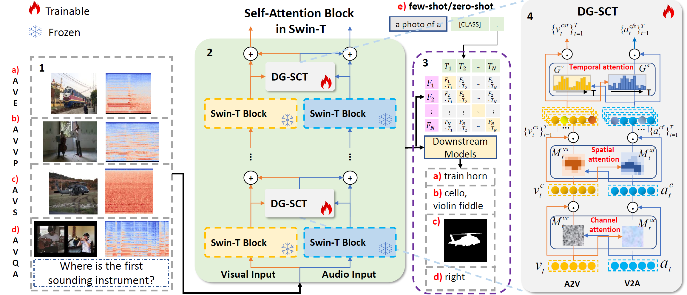
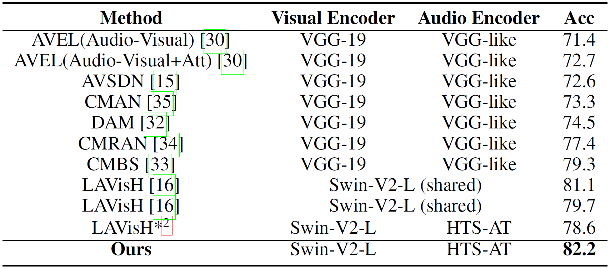
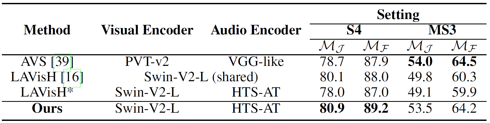
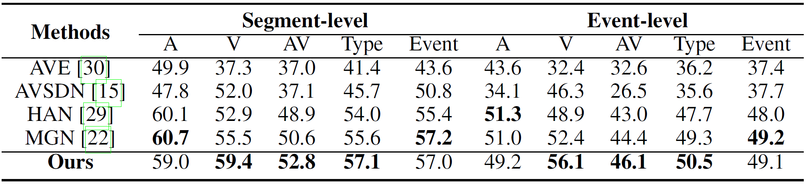
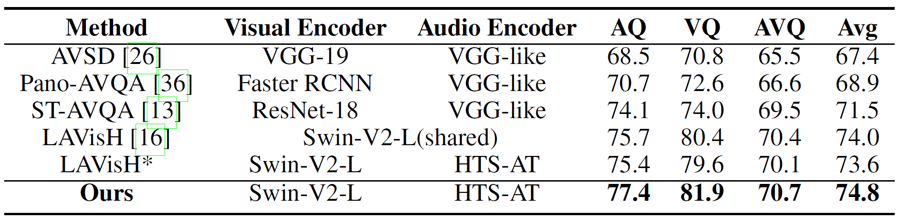

# Cross-modal Prompts: Adapting Large Pre-trained Models for Audio-Visual Downstream Tasks, NeurIPS 2023




This is the Pytorch implementation of our paper:

[Cross-modal Prompts: Adapting Large Pre-trained Models for Audio-Visual Downstream Tasks](https://openreview.net/forum?id=9MwidIH4ea)

[[Paper](https://openreview.net/pdf?id=9MwidIH4ea)] [[arXiv](https://arxiv.org/abs/2311.05152)] [[Video](https://recorder-v3.slideslive.com/#/share?share=85773&s=88f00392-b03f-497a-b0c8-1441cc471e50)] [[Poster](https://neurips.cc/media/PosterPDFs/NeurIPS%202023/72602.png?t=1699521476.3931298)] [[Slides](https://neurips.cc/media/neurips-2023/Slides/72602.pdf)]

[Haoyi Duan](https://haoyi-duan.github.io/), [Yan Xia](https://scholar.google.com/citations?user=6kEbV3IAAAAJ&hl=en), [Mingze Zhou](https://github.com/Themoonlightoflibai), [Li Tang](https://scholar.google.com.hk/citations?hl=en&user=PsHyxDcAAAAJ), [Jieming Zhu](https://scholar.google.com/citations?user=oNKerP8AAAAJ), [Zhou Zhao](https://scholar.google.com.hk/citations?user=IIoFY90AAAAJ)

In NeurIPS 2023

------

### 📝Requirements and Installation

- ###### Getting Started

```python
git clone https://github.com/haoyi-duan/DG-SCT
cd DG-SCT
pip install -r requirements.txt
```

- ###### Download HTS-AT Backbone

  Download `checkpoints.zip` from [Google Drive](https://drive.google.com/file/d/1L_ESw_ndOwSYChE3nw1zN1Hjy5ohSN80/view?usp=drive_link) or [Baidu Disk](https://pan.baidu.com/s/1uCLyWZss4RWtapEOmxHmSg) (pwd: 2023), and extract it into the directory `./DG-SCT`/.

## AVE

- ###### Download Data

  Download `frames.zip` from [Google Drive](https://drive.google.com/file/d/1pK0eEhEtYvqccrLcZh5QTWxVYN1kBQhY/view?usp=drive_link) or [Baidu Disk](https://pan.baidu.com/s/1WZbUISj--AM1gjPD_vNKvw ) (pwd: 2023), `wave.zip` from [Google Drive](https://drive.google.com/file/d/19os2iUx1Cjwxem40Q5cqMN2CGxO4zEJe/view?usp=drive_link) or [Baidu Disk](https://pan.baidu.com/s/1RIBUnruiI1e_LNKiMS_prA) (pwd: 2023), and extract them into the directory `./data/AVE`/.

- ###### Usage

  Go to AVE task directory.

  ```
  cd DG-SCT/AVE
  ```

  - Training

    ```c
    bash train.sh
    ```

  - Testing

    `./models/best_82.18.pt`: [Google Drive](https://drive.google.com/file/d/1MICcnGwyd-ELFIeWBGLBr5UqMjSRHeZN/view?usp=drive_link) or [Baidu Disk](https://pan.baidu.com/s/16K51iO0LD-PuUiaa0NlGVQ) (pwd: 2023)

    ```
    bash test.sh
    ```

- ###### Results

  

## AVS

- ###### Download Data

  - Download Dataset

    The updated AVSBench dataset is available [here](http://www.avlbench.opennlplab.cn/download) (`AVSBench-object`). You may request the dataset by filling the [Google Form](https://forms.gle/GKzkU2pEkh8aQVHN6).

    The downloaded data should be placed to the directory `./data/`.

  - Download Wave

    Download wave for task **S4** ([Google Drive](https://drive.google.com/file/d/1Sb5pQZfL1mPPz0RakjdNw2cG_Cd7l3RH/view?usp=drive_link) or [Baidu Disk](https://pan.baidu.com/s/1kaKSHNx2c7qtAYpceL2PMw) (pwd: 2023)) and task **MS3** ([Google Drive](https://drive.google.com/file/d/1duAe9ryUZosTGYl29YYHRcTVCP7DrjF1/view?usp=drive_link) or [Baidu Disk](https://pan.baidu.com/s/1IQkTnnXRte6AXQ-aOpWFHA) (pwd: 2023)), and extract them into the directory `./data/AVSBench_data/Single-source/s4_data/` and `./data/AVSBench_data/Multi-sources/ms3_data/`, respectively.

- ###### Download pretrained backbones

  The pretrained ResNet50/PVT-v2-b5 (vision) and VGGish (audio) backbones can be downloaded from [here](https://drive.google.com/drive/folders/1386rcFHJ1QEQQMF6bV1rXJTzy8v26RTV?usp=sharing) and placed to the directory `./DG-SCT/AVS/pretrained_backbones/`.

- ###### Usage

  Go to AVS task directory.

  ```python
  # for S4 task:
  cd DG-SCT/AVS/avs_scripts/avs_s4
  
  # for MS3 task:
  cd DG-SCT/AVS/avs_scripts/avs_ms3
  ```

  - Training

    ```python
    bash train.sh
    ```

  - Testing

    checkpoint for **S4** task: `./DG-SCT/AVS/avs_scripts/avs_s4/train_logs` [Google Drive](https://drive.google.com/drive/folders/10NuIQG6n4JKuMO4a_zZ9B7DWTYohDp9k?usp=drive_link) or [Baidu Disk](https://pan.baidu.com/s/1BoR4jYAMPIm_dsmYO4GpsA) (pwd:2023)

    checkpoint for **MS3** task: `./DG-SCT/AVS/avs_scripts/avs_ms3/train_logs` [Google Drive](https://drive.google.com/drive/folders/1kqbtVN8FSEN-Xo1xX7vCAU5rI7vVJRjU?usp=drive_link) or [Baidu Disk](https://pan.baidu.com/s/1kREd81gssJhdJB9V-4E86g) (pwd:2023)

    ```
    bash test.sh
    ```

- ###### Results

  

## AVVP

- ###### Download Data

  Download extracted feats, frame and wave of LLP dataset from [Baidu Disk](https://pan.baidu.com/s/1ABUAuyPPguEjPS_MNgNAOQ) (pwd: 2023), and extract it into the directory `./data/AVVP/`. 

- ###### Usage

  Go to AVVP task directory:

  ```
  cd DG-SCT/AVVP
  ```

  - Training

    ```
    bash train.sh
    ```

  - Testing

    `./models/MGN_Net.pt`: [Google Drive](https://drive.google.com/file/d/1kc5I9B3216vWa-DJGOAgx7anssell-92/view?usp=drive_link) or [Baidu Disk](https://pan.baidu.com/s/1sgDNcGnCiCf3cr98QUrjyA) (pwd:2023)

    ```
    bash test.sh
    ```

- ###### Results

  

## AVQA

- ###### Download Data

  Download `frames.zip` from [Google Drive](https://drive.google.com/file/d/1-jtSv4FelmzGwCZNBfzIMi9H2M4gcRiX/view?usp=drive_link) or [Baidu Disk](https://pan.baidu.com/s/1qzNQKQD9YAYUlSBrPtwk6g) (pwd: 2023), `audio_wave.zip` from [Google Drive](https://drive.google.com/file/d/1iOe_cvCH2dVYh7LnbbxIewiWE9QLrW7i/view?usp=drive_link) or [Baidu Disk](https://pan.baidu.com/s/1GbFI_08uPEMwmI8fNlpf3g) (pwd: 2023), and extract them into the directory `./data/AVQA/`.

- ###### Usage

  Go to AVQA task directory.

  ```
  cd DG-SCT/AVQA
  ```

  - Audio-Visual Grounding Generation

    ```python
    python grounding_gen/main_grd_gen.py
    ```

    You can download the `./grounding_gen/models_grounding_gen/lavish_grounding_gen_best.pt` from [Google Drive](https://drive.google.com/file/d/1mOHQCGbXPCDFJnuDDILzdYlv2pkd_Lcc/view?usp=drive_link) or [Baidu Disk](https://pan.baidu.com/s/1kzquP9SNj1lWHZGFaD9TJg) (pwd: 2023) to skip the **Audio-Visual Grounding Generation** process.

  - Training

    ```
    bash train.sh
    ```

  - Testing

    `./net_grd_avst/avst_models/avst.pt`: [Google Drive](https://drive.google.com/file/d/1dcT4VtW6s-lb1uu4lQmWbbGkxHtFqs7g/view?usp=drive_link) or [Baidu Disk](https://pan.baidu.com/s/1dLBKVjV6N2mqeivcux6J2Q) (pwd: 2023)

    ```
    bash test.sh
    ```

- ###### Results

  

## Few-shot/Zero-shot

We use audio-text backbones in [CLAP](https://github.com/LAION-AI/CLAP/): [630k-audioset-fusion-best.pt](https://huggingface.co/lukewys/laion_clap/blob/main/630k-audioset-fusion-best.pt), and [630k-fusion-best.pt](https://huggingface.co/lukewys/laion_clap/blob/main/630k-fusion-best.pt). Please download and place them into the directory `./pretrain/models/`.

- ### Few-shot

  - ###### Go to Few-shot Directory

    ```
    cd few-shot
    ```

  - ###### AVE

    - 1 shot

      ```python
      python main_AVE.py --dataset_name AVE --shot 1 --alpha 0.2 --beta 0.05 --gamma 0.01 --weak 0 --classification 0
      ```

    - 2 shots

      ```python
      python main_AVE.py --dataset_name AVE --shot 2 --alpha 0.2 --beta 0.05 --gamma 0.01 --weak 0 --classification 0
      ```

    - 4 shots

      ```python
      python main_AVE.py --dataset_name AVE --shot 4 --alpha 0.2 --beta 0.05 --gamma 0.01 --weak 0 --classification 0
      ```

    - 8 shots

      ```python
      python main_AVE.py --dataset_name AVE --shot 8 --alpha 0.2 --beta 0.05 --gamma 0.01 --weak 0 --classification 0
      ```

    - 16 shots

      ```python
      python main_AVE.py --dataset_name AVE --shot 16 --alpha 0.2 --beta 0.05 --gamma 0.01 --weak 0 --classification 0
      ```

  - ###### AVE Classification

    - 1 shot

      ```python
      python main_AVE_class.py --dataset_name AVE --shot 1 --alpha 0.2 --beta 0.05 --gamma 0.05 --weak 1 --classification 1
      ```

    - 2 shots

      ```python
      python main_AVE_class.py --dataset_name AVE --shot 2 --alpha 0.2 --beta 0.05 --gamma 0.05 --weak 1 --classification 1
      ```

    - 4 shots

      ```python
      python main_AVE_class.py --dataset_name AVE --shot 4 --alpha 0.2 --beta 0.05 --gamma 0.05 --weak 1 --classification 1
      ```

    - 8 shots

      ```python
      python main_AVE_class.py --dataset_name AVE --shot 8 --alpha 0.2 --beta 0.05 --gamma 0.05 --weak 1 --classification 1
      ```

    - 16 shots

      ```python
      python main_AVE_class.py --dataset_name AVE --shot 16 --alpha 0.2 --beta 0.05 --gamma 0.05 --weak 1 --classification 1
      ```

  - ###### LLP Classification

    - 1 shot

      ```python
      python main_LLP_class.py --dataset_name LLP --shot 1 --alpha 0.2 --beta 0.05 --gamma 0.05 --weak 1 --classification 1
      ```

    - 2 shots

      ```python
      python main_LLP_class.py --dataset_name LLP --shot 2 --alpha 0.2 --beta 0.05 --gamma 0.05 --weak 1 --classification 1
      ```

    - 4 shots

      ```python
      python main_LLP_class.py --dataset_name LLP --shot 4 --alpha 0.2 --beta 0.05 --gamma 0.05 --weak 1 --classification 1
      ```

    - 8 shots

      ```python
      python main_LLP_class.py --dataset_name LLP --shot 8 --alpha 0.2 --beta 0.05 --gamma 0.05 --weak 1 --classification 1
      ```

    - 16 shots

      ```python
      python main_LLP_class.py --dataset_name LLP --shot 16 --alpha 0.2 --beta 0.05 --gamma 0.05 --weak 1 --classification 1
      ```

- ### Zero-shot

  - ###### Download Data

    Download **VGG-Sound(40K)** from [Baidu Disk](https://pan.baidu.com/s/1PmC_RpQpGv4UNiteoAhtBg) (pwd: 2023), and extract it into the directory `./data/`.

  - ###### Usage

    - Pretrain on VGG-Sound(40K)

      ```
      cd pretrain
      bash train.sh
      ```

      The pretrained model will be placed at `pretrain/models/`.

    - Zero-shot

      ```python
      MODEL_NAME="name of the pretrained model in pretrain/models/."
      # AVE
      python zero_shot.py --test_dataset_name AVE --backbone $MODEL_NAME --is_event_score 1
      
      # AVE classification
      python zero_shot.py --test_dataset_name AVE --backbone $MODEL_NAME --is_event_score 0
      
      # LLP classification
      python zero_shot.py --test_dataset_name LLP --backbone $MODEL_NAME --is_event_score 0
      ```

- ### Results


## 🎓Cite

If you find this work useful, please consider citing it.

```
@inproceedings{duan2023cross,
  title={Cross-modal Prompts: Adapting Large Pre-trained Models for Audio-Visual Downstream Tasks},
  author={Duan, Haoyi and Xia, Yan and Zhou, Mingze and Tang, Li and Zhu, Jieming and Zhao, Zhou},
  booktitle={Thirty-seventh Conference on Neural Information Processing Systems},
  year={2023}
}
```

## 👍Acknowledgments

Our code is based on [CMBS](https://github.com/marmot-xy/CMBS), [AVSBench](https://github.com/OpenNLPLab/AV[SBench), [MGN](https://github.com/stoneMo/MGN), [MUSIC-AVQA](https://github.com/GeWu-Lab/MUSIC-AVQA), and [LAVisH](https://github.com/GenjiB/LAVISH).

## ✏Model Checkpoints

| Tasks   | Checkpoints                                                  |
| ------- | ------------------------------------------------------------ |
| AVE     | [Google Drive](https://drive.google.com/file/d/1pK0eEhEtYvqccrLcZh5QTWxVYN1kBQhY/view?usp=drive_link) or [Baidu Disk](https://pan.baidu.com/s/1WZbUISj--AM1gjPD_vNKvw ) (pwd: 2023) |
| AVS_S4  | [Google Drive](https://drive.google.com/drive/folders/10NuIQG6n4JKuMO4a_zZ9B7DWTYohDp9k?usp=drive_link) or [Baidu Disk](https://pan.baidu.com/s/1BoR4jYAMPIm_dsmYO4GpsA) (pwd:2023) |
| AVS_MS3 | [Google Drive](https://drive.google.com/drive/folders/1kqbtVN8FSEN-Xo1xX7vCAU5rI7vVJRjU?usp=drive_link) or [Baidu Disk](https://pan.baidu.com/s/1kREd81gssJhdJB9V-4E86g) (pwd:2023) |
| AVVP    | [Google Drive](https://drive.google.com/file/d/1kc5I9B3216vWa-DJGOAgx7anssell-92/view?usp=drive_link) or [Baidu Disk](https://pan.baidu.com/s/1sgDNcGnCiCf3cr98QUrjyA) (pwd:2023) |
| AVQA    | [Google Drive](https://drive.google.com/file/d/1dcT4VtW6s-lb1uu4lQmWbbGkxHtFqs7g/view?usp=drive_link) or [Baidu Disk](https://pan.baidu.com/s/1dLBKVjV6N2mqeivcux6J2Q) (pwd: 2023) |
